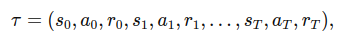
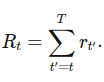
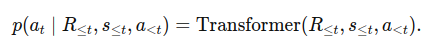
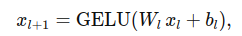
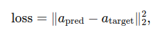

# Enhanced Decision Transformer for Offline Reinforcement Learning

## Abstract
This project builds upon the Decision Transformer framework for **offline Reinforcement Learning (RL)**, introducing architectural enhancements and experiments on custom Atari datasets. We modify both the Transformer-based policy (in `gym/decision_transformer/models/`) and a baseline MLP model (in `gym/decision_transformer/models/mlp_bc.py`) to test whether these improvements yield better performance. Additionally, we leverage datasets from Atari environments, such as the `ALEGalaxian-v5` dataset (found in the `atari/` directory), to evaluate the model's ability to generalize.

This document provides an overview of the enhancements, datasets, training procedure, and preliminary results.

---

## Introduction
The Decision Transformer [1] reframes RL as a **sequence modeling problem**. Given a desired return-to-go, it uses a Transformer model (inspired by GPT architectures) to predict actions that achieve this return. The state, action, and return tokens are stacked and fed into a causal transformer.

Our contributions are:
- **Enhanced MLP Baseline:** In `gym/decision_transformer/models/mlp_bc.py`, we increase network depth, add normalization layers, and switch to smoother activation functions (e.g., **GELU**) to improve stability and accuracy.
- **Deeper Decision Transformer:** In `gym/decision_transformer/models/decision_transformer.py`, we add more layers and attention heads, incorporate dropout and additional layer normalization, and adjust hyperparameters to handle complex datasets.
- **Custom Atari Datasets:** Under `atari/`, we experiment with datasets like `ALEGalaxian-v5`. By modifying preprocessing and segmenting trajectories differently, we test whether the improved models can generalize better than the original Decision Transformer.

---

## Background
Consider a trajectory:

where rt is the reward at time t. The return-to-go from time t is:

The Decision Transformer conditions on (Rt, st, at-1, …) to predict at. Stacking the tokens as (R1, s1, a1, R2, s2, a2, …), we apply a causal self-attention mask so the model only attends to past tokens:

---

## Enhancements in the `gym` and `atari` Directories
**Directory structure**:
- **`atari/`**: Scripts and code for Atari data handling, including the `ALEGalaxian-v5` dataset.
- **`gym/`**: Implementations of the Decision Transformer and MLP BC models, training scripts, and utilities for loading custom datasets.

### Enhanced MLP Model
The MLP model now includes:
- **Multiple hidden layers** with **GELU** activation:

  

  This provides smoother gradients and potentially better convergence.
- **Layer normalization** and **dropout** between layers to reduce internal covariate shift and overfitting.

### Enhanced Decision Transformer
The Transformer model includes:
- **More Transformer layers** (e.g., `n_layer = 6`) and extra attention heads to increase representational capacity.
- **Dropout** in embeddings and output representations to improve generalization.
- An additional `LayerNorm` applied after the Transformer block and before predictions.

---

## Custom Atari Datasets
The Atari datasets (e.g., `ALEGalaxian-v5`) provide a variety of trajectories. We:
- Modify trajectory splitting and return distributions.
- Introduce variable-length trajectories and altered state preprocessing.
- Evaluate whether these enhancements help the model adapt to complex Atari data and consistently achieve desired returns.

---

## Training and Preliminary Results
Training is handled by a `Trainer` class:

Here, apred is the predicted action, and atarget is the ground truth from the dataset.

Early experiments show:
- Faster convergence and lower training losses with the enhanced MLP.
- More stable training with the deeper Decision Transformer on modified Atari datasets.

Further evaluation and hyperparameter tuning are ongoing.

---

## Conclusion
By enhancing both the MLP baseline and the Decision Transformer architecture, and by experimenting on modified Atari datasets, we aim to push the limits of sequence-modeling-based RL. Initial results look promising, and ongoing work focuses on further optimization and evaluation.

---

## References
1. **Decision Transformer: Reinforcement Learning via Sequence Modeling**  
   Lili Chen, Kevin Lu, Aravind Rajeswaran, Kimin Lee, Aditya Grover, Michael Laskin, Pieter Abbeel, Aravind Srinivas, and Igor Mordatch.  
   [arXiv preprint arXiv:2106.01345 (2021)](https://arxiv.org/abs/2106.01345)

---

**Note:** You may need `numpy`, `torch`, `gym`, `transformers`, and additional dependencies for Atari environments (e.g., `ale_py`). Check `requirements.txt` or `environment.yml` for version details.
